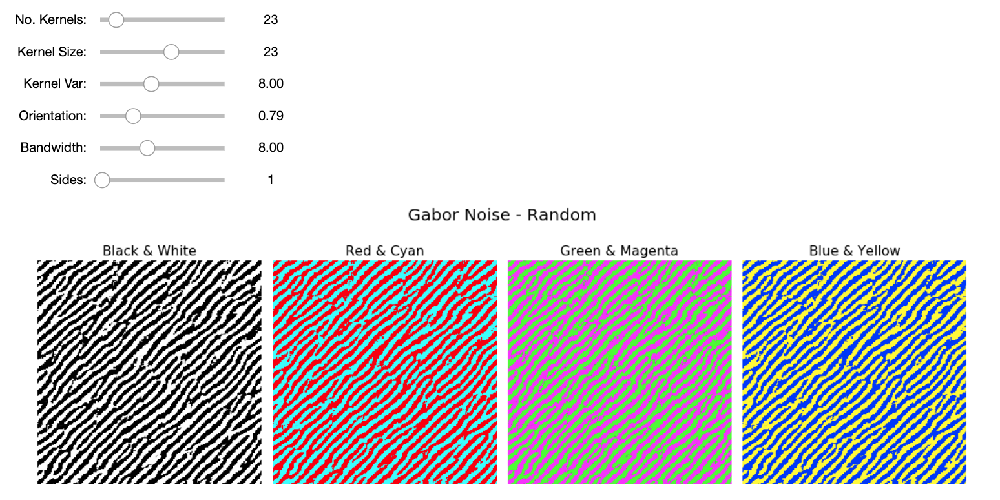
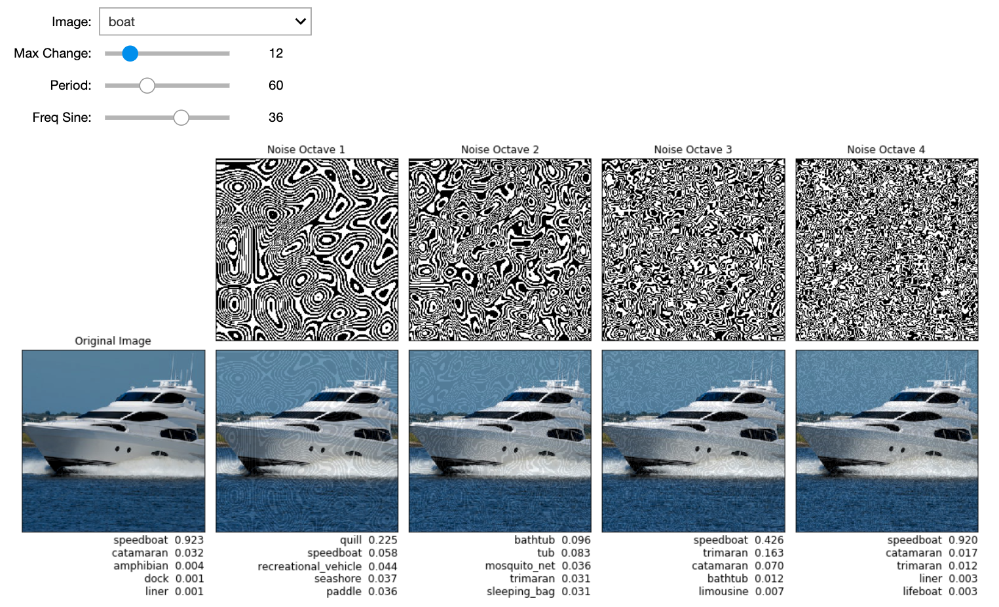

# Procedural Noise UAPs

This repository contains sample code and an interactive Jupyter notebook for the papers:

* ["Procedural Noise Adversarial Examples for Black-Box Attacks on Deep Convolutional Networks"](https://dl.acm.org/citation.cfm?id=3345660) (CCS'19)
* ["Sensitivity of Deep Convolutional Networks to Gabor Noise"](https://openreview.net/forum?id=HJx08NSnnE) (ICML'19 Workshop)

In this work, we show that Universal Adversarial Perturbations (UAPs) can be generated with **procedural noise** functions without any knowledge of the target model. Procedural noise functions are fast and lightweight methods for generating textures in computer graphics, this enables low cost black-box attacks on deep convolutional networks for computer vision tasks. 

We encourage you to explore our Python notebooks and make your own adversarial examples:

1. `intro_bopt.ipynb` shows how Bayesian optimization can find better parameters for the procedural noise functions.

2. `intro_gabor.ipynb` gives a brief introduction to Gabor noise. 


3. `slider_gabor.ipynb`, `slider_perlin` visualize and interactively play with the parameters to see how it affects model predictions.


See our [paper](https://dl.acm.org/citation.cfm?id=3345660) for more details: "Procedural Noise Adversarial Examples for Black-Box Attacks on Deep Convolutional Networks." Kenneth T. Co, Luis Muñoz-González, Emil C. Lupu. CCS 2019.


## Acknowledgments


Learn more about the [Resilient Information Systems Security (RISS)](http://rissgroup.org/) group at Imperial College London. Kenneth Co is partially supported by [DataSpartan](http://dataspartan.co.uk/).

If you find this project useful in your research, please consider citing:

```
@inproceedings{co2019procedural,
 author = {Co, Kenneth T. and Mu\~{n}oz-Gonz\'{a}lez, Luis and de Maupeou, Sixte and Lupu, Emil C.},
 title = {Procedural Noise Adversarial Examples for Black-Box Attacks on Deep Convolutional Networks},
 booktitle = {Proceedings of the 2019 ACM SIGSAC Conference on Computer and Communications Security},
 series = {CCS '19},
 year = {2019},
 isbn = {978-1-4503-6747-9},
 location = {London, United Kingdom},
 pages = {275--289},
 numpages = {15},
 url = {http://doi.acm.org/10.1145/3319535.3345660},
 doi = {10.1145/3319535.3345660},
 acmid = {3345660},
 publisher = {ACM},
 address = {New York, NY, USA},
 keywords = {adversarial machine learning, bayesian optimization, black-box attacks, deep neural networks, procedural noise, universal adversarial perturbations},
}
```
This project is licensed under the MIT License, see the [LICENSE.md](LICENSE.md) file for details.
